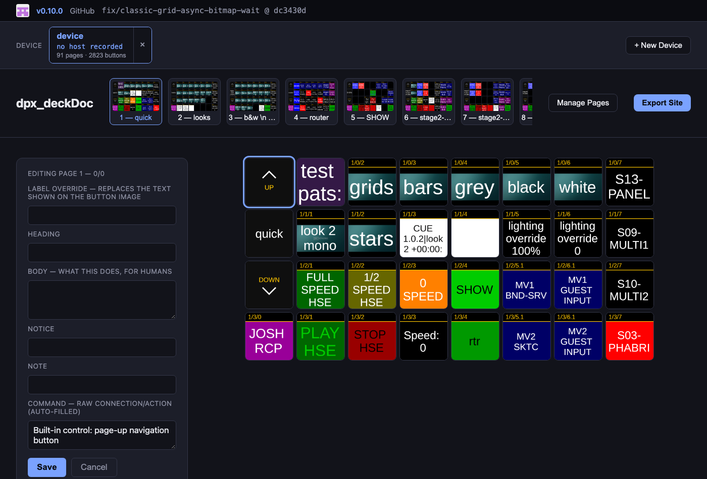
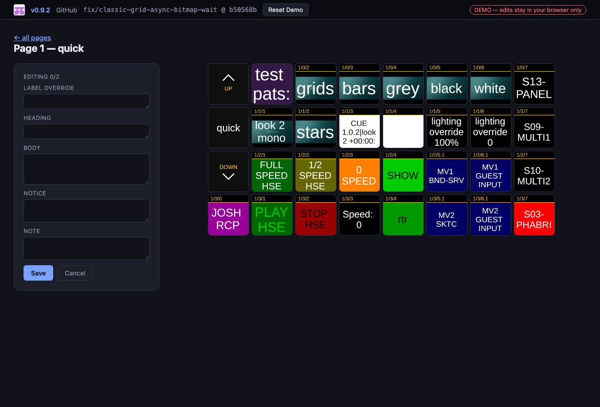

<!-- Improved compatibility of back to top link: See: https://github.com/othneildrew/Best-README-Template/pull/73 -->
<a id="readme-top"></a>

<!-- dubpixel fork of Best-README-Template, software variant. -->

<!-- PROJECT SHIELDS -->
<div align="center">


</div>
<!-- PROJECT LOGO -->
<div align="center">
  <a href="https://github.com/dubpixel/dpx_deckDoc">
    
  </a>
<h1 align="center">dpx_deckDoc</h1>
<h3 align="center"><i>auto-generated documentation for your Bitfocus Companion / Stream Deck rig</i></h3>
  <p align="center">
    Capture every button, annotate it, ship it as a browsable, editable site — show-control documentation without the live walkthrough.
    <br />
     »  
     <a href="https://dubpixel.github.io/dpx_deckDoc/"><strong>Read the Manual</strong></a>
     »  
     <a href="https://dubpixel.github.io/dpx_deckDoc/demo/"><strong>Try the Demo</strong></a>
     »  
     <br />
    <a href="https://github.com/dubpixel/dpx_deckDoc/issues/new?labels=bug&template=bug-report---.md">Report Bug</a>
    ·
    <a href="https://github.com/dubpixel/dpx_deckDoc/issues/new?labels=enhancement&template=feature-request---.md">Request Feature</a>
    </p>
</div>
   <br />
<!-- TABLE OF CONTENTS -->
<details>
  <summary><h3>Table of Contents</h3></summary>
<ol>
    <li>
      <a href="#about-the-project">About The Project</a>
      <ul>
        <li><a href="#built-with">Built With</a></li>
      </ul>
    </li>
    <li>
      <a href="#getting-started">Getting Started</a>
      <ul>
        <li><a href="#prerequisites">Prerequisites</a></li>
        <li><a href="#installation">Installation</a></li>
      </ul>
    </li>
    <li><a href="#usage">Usage</a></li>
    <li><a href="#testing">Testing</a></li>    
    <li><a href="#reflection">Reflection</a></li>
    <li><a href="#roadmap">Roadmap</a></li>
    <li><a href="#contributing">Contributing</a></li>
    <li><a href="#license">License</a></li>
    <li><a href="#contact">Contact</a></li>
    <li><a href="#acknowledgments">Acknowledgments</a></li>
</ol>
</details>
<!-- ABOUT THE PROJECT -->
<details>
<summary><h3>About The Project</h3></summary>

**dpx_deckDoc is a documentation and annotation tool for [Bitfocus Companion](https://bitfocus.io/companion) — the free, open-source software that turns an Elgato Stream Deck (or any StreamDeck-style button surface) into a show-control panel for broadcast, live events, theatre, houses of worship, and studio automation.**

A real Companion setup can have dozens of pages and hundreds of buttons wired to OSC, MIDI, ATEM, disguise, vMix, QLab, TSL/UMD, and every other connection Companion supports — and none of that is self-explanatory to someone who didn't build it. dpx_deckDoc solves that by:

- **Capturing** the real, rendered look of every button directly from Companion's own tablet web UI (no screenshots, no guesswork — the actual button bitmap as Companion draws it, per page/row/col)
- **Annotating** each button with structured notes (heading, body, a red **notice**, an italic **note**) — pre-filled automatically from a `.companionconfig` export's connection/action data, then refined by hand
- **Publishing** a browsable, editable local web app (`node src/cli.js serve`) for authoring, and a frozen, dependency-free static site (`node src/cli.js build`) for handoff — open `index.html`, no server required

Use cases: Stream Deck / Companion button-map documentation, show-control runbooks, operator handoff docs, broadcast control-room reference sheets, venue/FOH button legends.

See the full concept doc on Notion (`dpx_labs / dpx_deckDoc`) for background and open TODOs.

<br>

| Live editor — click a button to write it up | Static handoff site — hover for the annotation |
|---|---|
|  |  |

*(screenshots above are from the [live demo](https://dubpixel.github.io/dpx_deckDoc/demo/) — a real captured rig, fully editable in your browser)*

</br>

*author(s): // www.dubpixel.tv  - i@dubpixel.tv | other authors* 
</br>
</details>
<p align="right">(<a href="#readme-top">back to top</a>)</p>

### Built With 

* Node.js (vanilla, no bundler, no framework)
* Plain `node:http` for the live editor server — no Express
* [Playwright](https://playwright.dev/) — pulls real per-button bitmaps out of Companion's tablet web UI DOM
* Bitfocus Companion's `.companionconfig` export format and `/int/export/full` endpoint for annotation prefill

<p align="right">(<a href="#readme-top">back to top</a>)</p>
<!-- GETTING STARTED -->

## Getting Started

  ### Prerequisites
  * Node.js
  * A reachable Bitfocus Companion instance (Satellite API port 16622 and/or web UI port 8000)

  ### Installation

  1. `npm install`

<p align="right">(<a href="#readme-top">back to top</a>)</p>

<!-- USAGE EXAMPLES -->
## Usage

```bash
node src/cli.js scrape --host <companion-ip> --device <name>   # one shot: capture everything
node src/cli.js serve --out devices                            # live, editable authoring app
node src/cli.js build --out devices/<name>                     # frozen static handoff site
```

`scrape` points at one Companion instance and does the whole thing: pulls the config export, discovers every real page, captures every button's actual rendered bitmap, and pre-fills annotations — no per-page looping. Each instance becomes a **device** under `devices/<name>/`, so multiple rigs live side by side (device → pages → buttons).

`serve` opens a local editable app (`http://localhost:4321`) with a device switcher — hover a button for a preview, click to edit Heading / Body / Notice / Note / Command / Label override, saves straight to `devices/<name>/annotations.json`. Includes an in-browser "+ New Device" (scrape without the CLI) and "Export Site" (runs `build` and serves the result back) — the CLI commands above are the primitives; day-to-day use can happen entirely from the browser. `build` freezes one device into `devices/<name>/site/index.html` — open it directly, no server needed, for handing off to someone else.

## Testing

```bash
npm test
```

Node's built-in test runner (`node --test`, zero extra dependencies) — covers the annotation store's prefill/manual-edit invariants, the config parser against a schema-accurate fixture, the manifest and page-selection helpers, `buildSite()` end-to-end (including the `type="module"`/`file://` regression and page-selection filtering), and `serve.js`'s actual HTTP routes via a live server on an ephemeral port. Capture itself (`src/capture/screenshot.js`) isn't unit-tested — it's browser/DOM-coupled and its correctness depends on a real Companion instance; verify it by running `scrape` against a real target and checking the resulting page counts and images.

<!-- REFLECTION -->
## Reflection

* what did we learn? 
  - Companion's Satellite API `ADD-SUB` (read-only button subscription) turned out unnecessary — the tablet web UI's DOM already gives accurate, fully-rendered per-button bitmaps, and `.companionconfig`'s own export covers annotation data
  - The tablet UI virtualizes rows in a continuous scroller — capturing a page requires scrolling through and merging results, or rows below the fold get silently missed
  - `<script type="module">` fails under `file://` due to CORS — the static handoff site has to use plain scripts, not ES modules
* what do we like/hate?
  - Like: no-build-step philosophy keeps the whole thing auditable and easy to run anywhere
* what would/could we do differently?
  - N/A currently
  <!-- ROADMAP -->
## Roadmap

- [x] Web UI capture backend — real per-button bitmaps, virtualization-safe (scrolls + merges)
- [x] `.companionconfig` parser for annotation pre-fill — schema confirmed against a real export
- [x] Structured annotation fields (Heading / Body / Notice / Note / Command) with non-destructive prefill merge
- [x] Live editable local app (`serve`) + frozen static handoff site (`build`)
- [x] Page thumbnails + real page titles in navigation
- [x] One-shot `scrape` command — discovers and captures an entire instance in one pass, verified against a real 99-page rig
- [x] Multi-device support — device → pages → buttons tree, device switcher in the live editor
- [x] Device host metadata + delete-a-device in the live editor
- [x] GitHub Pages manual (repo website) — [issue #6](https://github.com/dubpixel/dpx_deckDoc/issues/6)
- [x] Demo site with dummy data on GitHub Pages (static/read-only) — [issue #7](https://github.com/dubpixel/dpx_deckDoc/issues/7)
- [x] Demo rebuilt from a real captured device and made editable (client-side, per-visitor `localStorage`) — [issue #14](https://github.com/dubpixel/dpx_deckDoc/issues/14)

See the [open issues](https://github.com/dubpixel/dpx_deckDoc/issues) for a full list of proposed features (and known issues).

<!-- CONTRIBUTING -->
## Contributing

_Contributions are what make the open source community such an amazing place to learn, inspire, and create. Any contributions you make are **greatly appreciated**._

If you have a suggestion that would make this better, please fork the repo and create a pull request. You can also simply open an issue with the tag "enhancement".
Don't forget to give the project a star! Thanks again!

1. Fork the Project
2. Create your Feature Branch (`git checkout -b feature/AmazingFeature`)
3. Commit your Changes (`git commit -m 'Add some AmazingFeature'`)
4. Push to the Branch (`git push origin feature/AmazingFeature`)
5. Open a Pull Request

### Top contributors:
<a href="https://github.com/dubpixel/dpx_deckDoc/graphs/contributors">
  
</a>

<!-- LICENSE -->
## License
Distributed under the UNLICENSED License (private/internal). See `LICENSE.txt` for more information.
<!-- CONTACT -->
## Contact

  ### Joshua Fleitell - i@dubpixel.tv

  Project Link: [https://github.com/dubpixel/dpx_deckDoc](https://github.com/dubpixel/dpx_deckDoc)

<!-- ACKNOWLEDGMENTS -->
## Acknowledgments

<!--
  * [ ]() - the best !
-->

<p align="right">(<a href="#readme-top">back to top</a>)</p>

<div align="center">

<br />
<sub>built by <a href="https://dubpixel.tv">dubpixel</a></sub>
</div>

<!-- MARKDOWN LINKS & IMAGES -->
